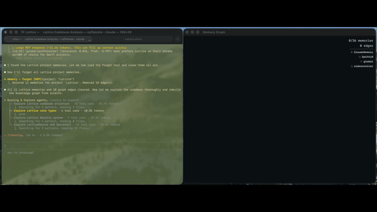

# ClaudeMemory

A local MCP server that gives Claude Code persistent, semantic memory across sessions.



## Why not MEMORY.md?

Claude Code has built-in memory via `MEMORY.md` files. Here's why ClaudeMemory is better:

| | MEMORY.md | ClaudeMemory |
|---|---|---|
| **Retrieval** | Dumps entire file into system prompt | Semantic vector search — only relevant memories surfaced |
| **Capacity** | Truncated at 200 lines | Unlimited — stores thousands, retrieves the best matches |
| **Search** | Position-based (top of file = seen first) | Hybrid FTS5 + vector similarity (most relevant = seen first) |
| **Cross-project** | Per-project files, no sharing | Project scoping + global scope — preferences follow you everywhere |
| **Maintenance** | Append-only text that gets stale | `update`, `merge`, `forget`, auto-expiring memories, conflict detection |
| **Structure** | Flat text, no relationships | Knowledge graph — connect memories with typed edges, traverse on recall |
| **Continuity** | No session awareness | Episodic memory, task checkpoints, clustering + consolidation |
| **Privacy** | Plain text files | Local SQLite + on-device embeddings (MiniLM-L6). Nothing leaves your machine |

**The one-liner:** MEMORY.md is 200 lines of flat text that gets stale. ClaudeMemory is a vector database that scales, searches semantically, and self-maintains.

## Tools

### Core

| Tool | Description |
|------|-------------|
| `remember` | Store a memory with semantic embedding. Conflict detection blocks near-duplicates (`force: true` to override). Optional `importance: 1-5` |
| `recall` | Hybrid FTS5 + vector search with project boosting, reinforcement scoring (frequency + importance + recency), temporal filters (`since`/`before`), and optional graph traversal (`depth: 1-3`) |
| `forget` | Delete by ID, topic, or project. Cascades edge cleanup |
| `update` | Edit by ID or similarity — full replace, `append`, `prepend`, `find`+`replace`, or metadata-only (`topic`, `source`, `expires_in_days`, `importance`) |
| `merge` | Consolidate multiple memories into one. Cleans up source edges |
| `stats` | Database overview with per-project and per-topic breakdowns |
| `list_topics` | List all topics with counts |
| `timeline` | Chronological memory view grouped by day/week/month with project, topic, and temporal filters |

### Knowledge Graph

| Tool | Description |
|------|-------------|
| `connect` | Create a directed edge between memories (`relates_to`, `contradicts`, `supersedes`, `derived_from`, `part_of`, `summarized_by`) |
| `disconnect` | Remove edges by edge ID or by (from, to) pair |
| `graph` | View a memory's neighborhood — shows connections up to a given depth |

### Task Continuity

| Tool | Description |
|------|-------------|
| `checkpoint` | Save work-in-progress state (plan, progress, context) for cross-session resume |
| `resume` | Load a task checkpoint and mark it active |
| `list_tasks` | List tasks filtered by project and/or status (active, paused, completed) |

### Episodic Memory

| Tool | Description |
|------|-------------|
| `begin_episode` | Start a named session episode. Auto-closes any active episode |
| `end_episode` | End an episode with optional summary |
| `recall_episode` | Replay an episode's memories in chronological order |
| `list_episodes` | List episodes filtered by project and/or status |

### Organization & Clustering

| Tool | Description |
|------|-------------|
| `organize` | Batch re-topic memories, create a hub memory, and link members via `part_of` edges |
| `detect_communities` | Label propagation on the knowledge graph to discover natural memory groups |
| `find_clusters` | Discover groups of semantically similar memories by cosine distance |
| `consolidate` | Create a summary memory from a cluster, deprioritize originals with `summarized_by` edges |

## Install

```bash
curl -sL https://raw.githubusercontent.com/jsflax/ClaudeMemory/main/scripts/install.sh | bash
```

This downloads the pre-built binary, registers the MCP server, and configures Claude Code — takes a few seconds.

To build from source instead:

```bash
git clone https://github.com/jsflax/ClaudeMemory.git
cd ClaudeMemory
./scripts/install.sh --from-source
```

Start a new Claude Code session — memory tools are immediately available.

## Memory Visualizer

An interactive force-directed graph visualization of your memory database, built with SwiftUI.

```bash
swift run -c release MemoryVisualizer
```

Or point it at a specific database:

```bash
CLAUDE_MEMORY_DB=~/path/to/memory.sqlite swift run -c release MemoryVisualizer
```

**Features:**
- Force-directed graph layout with project-colored nodes and inter-project repulsion
- FTS5-backed search with prefix matching — highlights matches, dims the rest
- Edge type filtering with color-coded relations (part_of, contradicts, supersedes, etc.)
- Time slider with play button to animate graph growth over time
- Project filtering toggles in the stats overlay
- Semantic cluster hulls drawn as translucent project-colored regions
- Minimap with click-to-navigate
- Detail panel with typewriter effect for selected memories
- Drag nodes, pan, zoom-to-cursor (scroll wheel + pinch)
- Keyboard shortcuts: Esc (deselect), Tab (cycle connections), Cmd+F (search), +/- (zoom), Cmd+Shift+E (export PNG)

## Uninstall

```bash
curl -sL https://raw.githubusercontent.com/jsflax/ClaudeMemory/main/scripts/uninstall.sh | bash
```

Removes the binary and MCP registration. Database is preserved at `~/.claude/memory.sqlite` (delete manually if desired).

## How it works

- **Embedding model**: [paraphrase-MiniLM-L6-v2](https://huggingface.co/sentence-transformers/paraphrase-MiniLM-L6-v2) runs locally via CoreML. 384-dimensional vectors.
- **Storage**: SQLite via [Lattice](https://github.com/jsflax/lattice) ORM with [sqlite-vec](https://github.com/asg017/sqlite-vec) for vector search and FTS5 for full-text search.
- **Transport**: stdio MCP — server starts with each Claude Code session, loads embedding model once, stays alive for the session duration.
- **Hybrid search**: Recall combines FTS5 full-text search (any matching term qualifies) with vector cosine similarity. Falls back to FTS5-only if the embedding model is unavailable.
- **Scoping**: Memories have `project` and `topic` fields. Project is a soft ranking signal — same-project and global memories rank higher, but cross-project results still surface if semantically relevant.
- **Knowledge graph**: Connect memories with typed directed edges. Recall with `depth > 0` follows edges via BFS to surface connected knowledge. Edges auto-cleanup on forget/merge.
- **Reinforcement scoring**: Recall ranking blends cosine similarity with three reinforcement signals — **frequency** (log-scaled access count, up to 15% boost), **importance** (explicit 1-5 rating, up to 20% boost), and **recency** (exponential decay from last access, up to 10% boost). Cosine similarity still dominates; reinforcement fine-tunes ordering among close matches.
- **Conflict detection**: `remember` checks for near-duplicates (cosine distance < 0.12 same-project, < 0.05 cross-scope). Blocks storage with a warning; use `force: true` to override.
- **Expiration**: Set `expires_in_days` for temporal context ("currently working on X"). Expired memories are filtered from recall automatically.
- **Episodic memory**: Opt-in session grouping via `begin_episode`/`end_episode`. Episodes are hub memories (topic: "episode") linked to member memories via `part_of` edges. Stale episodes auto-end after a 30-minute gap.
- **Task continuity**: `checkpoint` saves plan/progress/context state. `resume` restores it in a new session. Tasks persist across conversations.
- **Clustering**: `find_clusters` uses greedy cosine-distance clustering to find related memory groups. `consolidate` creates a summary, deprioritizes originals (importance -> 0), and links them with `summarized_by` edges. `organize` batch re-topics memories with automatic hub creation.
- **Cross-project linking**: `remember` auto-detects mentions of other project names in content and creates `relates_to` edges to those projects' hub memories.
- **Hooks**: Optional `memory-hooks` binary for Claude Code hooks integration — auto-injects recalled context before each message (`advise`) and nudges session learning after interactions (`analyze`).

## Configuration

| Environment variable | Default | Description |
|---|---|---|
| `CLAUDE_MEMORY_DB` | `~/.claude/memory.sqlite` | Database path |
| `CLAUDE_MEMORY_MODEL` | Bundled MiniLM-L6 | Custom embedding model path |

## Requirements

- macOS (CoreML for embeddings)
- Swift 6.2+
- Claude Code CLI
